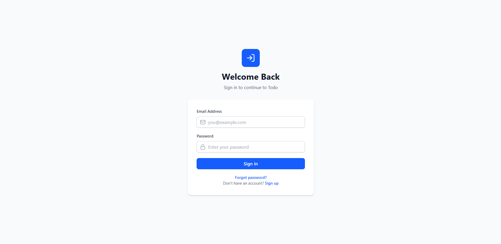
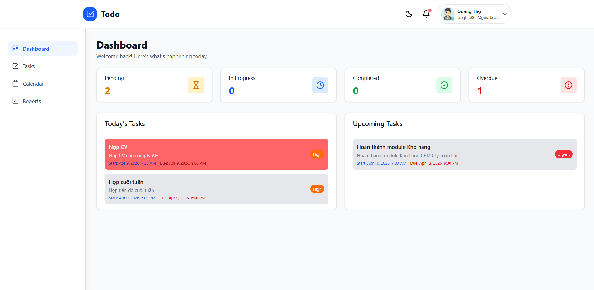

# 📝 Task Management Application (MERN Stack)

[](https://todo-fe-iyyx.onrender.com/)

Welcome to the **Task Management Application**, a robust, full-stack solution built to help individuals and teams organize, track, and complete their tasks efficiently. Designed with a modern user interface and a powerful backend, this application provides a seamless experience for task tracking, reporting, and calendar management.

## 🚀 Key Features

*   **🔒 Secure Authentication**: Robust user authentication system including Login, Register, Forgot Password, and Reset Password functionality, secured with JWT and bcrypt.
*   **✅ Comprehensive Task Management**: Create, view, update, and delete tasks. Categorize tasks by **Priority** (Low, Medium, High, Urgent) and track their **Status** (Pending, inProgress, Completed, Overdue) with automatic status lifecycle management.
*   **📊 Interactive Dashboard**: Visual insights into your productivity with charts and statistics (powered by Recharts).
*   **📅 Calendar Integration**: A full-featured calendar view to visualize task deadlines and schedules intuitively (powered by `react-big-calendar`).
*   **📈 Advanced Reporting**: Generate detailed reports of your tasks and activities with the ability to export them directly to PDF (using `jspdf`).
*   **👤 User Profiles & Notifications**: Manage your personal profile, including avatar uploads, and receive active updates via a notification system.
*   **📱 Responsive & Modern UI**: A sleek, beautifully designed interface utilizing Tailwind CSS, Framer Motion (tw-animate-css), and Radix UI components for an excellent user experience across all devices.

## 📸 Screenshots

<p align="center">
  
  &nbsp;
  
</p>

## 🛠️ Technology Stack

### Frontend
*   **React 19** with **Vite** for blazing fast development and builds.
*   **Tailwind CSS** (v4) & **Radix UI** for accessible, customizable, and modern styling.
*   **React Router DOM v7** for seamless, client-side routing.
*   **Recharts** for interactive data visualization.
*   **Axios** for handling HTTP requests.
*   **React Big Calendar** & **React Day Picker** for scheduling interfaces.
*   **jsPDF** & **jsPDF-AutoTable** for dynamic PDF report generation.
*   **Sonner** for beautiful, customizable toast notifications.

### Backend
*   **Node.js** & **Express.js** for a scalable, high-performance API.
*   **MongoDB** & **Mongoose** for flexible NoSQL database management.
*   **JSON Web Tokens (JWT)** for secure, stateless API authorization.
*   **Bcrypt.js** for strong password hashing and security.
*   **Nodemailer** for handling email communications (e.g., OTP and password resets).
*   **Cloudinary** & **Multer** for efficient media and image uploads.

## 📁 Project Structure

The project follows a standard client-server architecture, divided into two main directories:

```text
📦 Todo
 ┣ 📂 assets           # Screenshots and static assets for README
 ┣ 📂 backend          # Express.js RESTful API & MongoDB Setup
 ┃ ┣ 📂 src
 ┃ ┃ ┣ 📂 config       # Database and environment configurations
 ┃ ┃ ┣ 📂 controllers  # Business logic for corresponding routes
 ┃ ┃ ┣ 📂 middleware   # Custom middlewares (auth, file uploads, etc.)
 ┃ ┃ ┣ 📂 models       # Mongoose Schemas (User, Task)
 ┃ ┃ ┣ 📂 routes       # Express API routes (userRoute, taskRoute)
 ┃ ┃ ┣ 📂 utils        # Helper functions
 ┃ ┃ ┗ 📜 server.js    # Entry point for backend
 ┃ ┗ 📜 package.json
 ┣ 📂 frontend         # React/Vite Frontend Application
 ┃ ┣ 📂 src
 ┃ ┃ ┣ 📂 components   # Reusable React components (UI, auth wrappers)
 ┃ ┃ ┣ 📂 contexts     # React Context for global state (AuthContext)
 ┃ ┃ ┣ 📂 hooks        # Custom React hooks
 ┃ ┃ ┣ 📂 layout       # Structural layout components (AppLayout)
 ┃ ┃ ┣ 📂 lib          # Library configurations
 ┃ ┃ ┣ 📂 pages        # Main application views (Dashboard, Tasks, Calendar, etc.)
 ┃ ┃ ┗ 📜 App.jsx      # Root routing component
 ┃ ┣ 📜 vite.config.js
 ┃ ┗ 📜 package.json
 ┗ 📜 package.json     # Root package manager
```

## ⚙️ Getting Started

Follow these instructions to set up the project locally on your machine.

### Prerequisites
*   [Node.js](https://nodejs.org/) (v18.x or higher recommended)
*   [MongoDB](https://www.mongodb.com/) (Local instance or MongoDB Atlas cluster)
*   [Git](https://git-scm.com/)

### Installation

1.  **Clone the repository:**
    ```bash
    git clone https://github.com/quangthoIT/Todo.git
    cd Todo
    ```

2.  **Install Dependencies:**
    You can install dependencies for both frontend and backend using the root script:
    ```bash
    npm run build
    ```
    *(Alternatively, navigate to the `frontend` and `backend` directories separately and run `npm install` in each).*

3.  **Environment Variables:**
    *   Navigate to the `backend` directory and create a `.env` file.
    *   Add the necessary environment variables required for the backend services:
        ```env
        PORT=5001
        MONGODB_URI=your_mongodb_connection_string
        JWT_SECRET=your_jwt_secret_key
        # Nodemailer config (Email & App Password)
        # Cloudinary config (Cloud Name, API Key, API Secret)
        ```
    *   Navigate to the `frontend` directory and create a `.env` file if necessary (e.g., config for `VITE_API_URL` pointing to localhost:5001 locally).

### Running the Application

To run the application in your local development environment:

1.  **Start the Backend API Server:**
    ```bash
    cd backend
    npm run dev
    # The server typically runs on http://localhost:5001
    ```

2.  **Start the Frontend Client:**
    Open a new terminal session.
    ```bash
    cd frontend
    npm run dev
    # The Vite client typically runs on http://localhost:5173
    ```

*(Note: Ensure your MongoDB server is up and running before starting the backend).*
